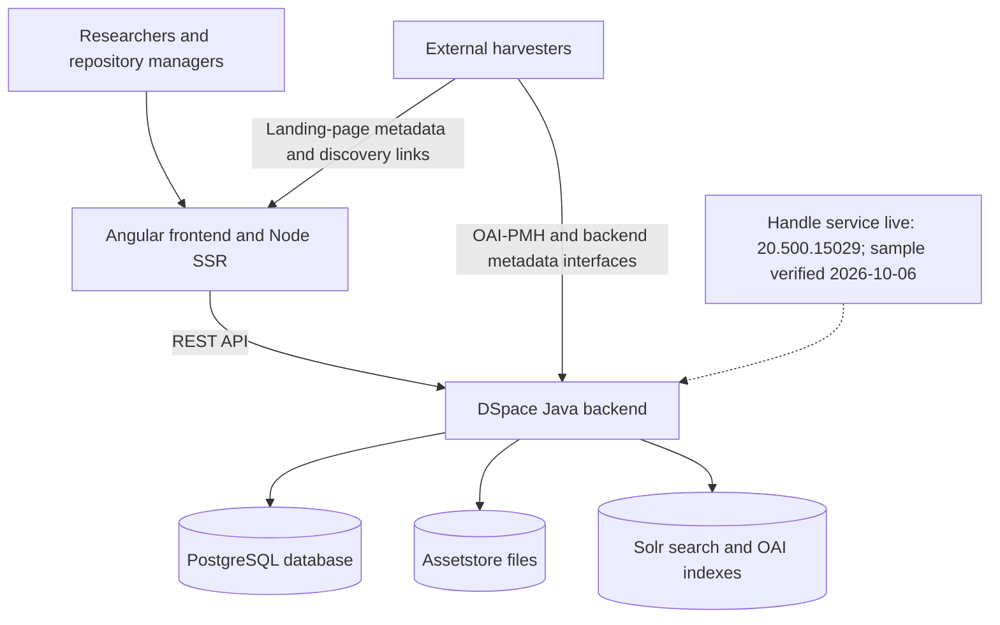
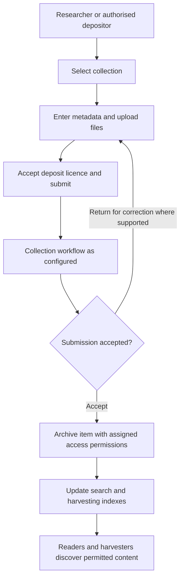
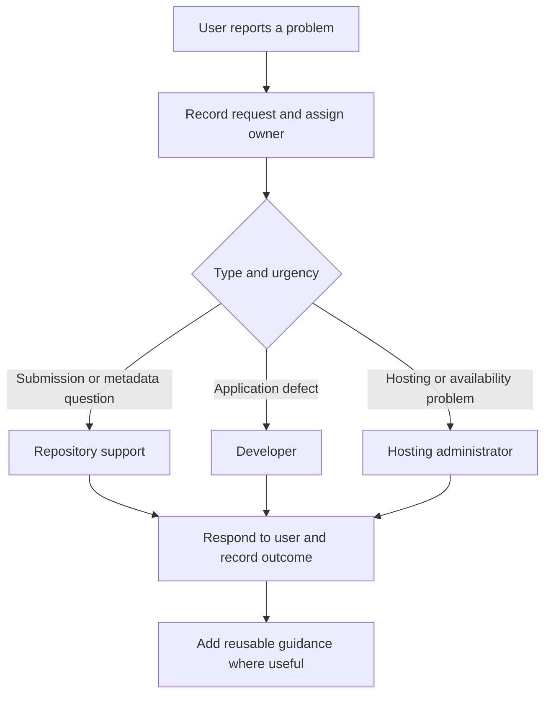

# UIST repository preparation for FIDELIS Support Offer 4

Prepared on 2 October 2026 from the frontend and backend repositories and the supplied training materials.

This is a first draft for the infrastructure diagram and process mapping assignments. It describes the application architecture found in source and identifies operational questions for UIST. Physical infrastructure, production configuration, staff assignments and actual working practices still need confirmation. No live service was checked during this review.

## Suggested introduction

“We are developing and maintaining the UIST Digital Repository using DSpace, with separate Angular frontend and Java backend repositories. The project includes database and file storage, search indexing, metadata harvesting and discovery interfaces. We have software tests and technical documentation. During this support programme, we want to map the complete service, clarify operational responsibilities, and make maintenance, user support and knowledge transfer easier for colleagues.”

Use this wording as a draft and adjust the description of your own role and team.

## Where to start

1. Review this architecture with the hosting administrator and add the actual hosts or virtual machines.
2. Walk through one real submission with a repository manager and record who performs each step.
3. Record how a recent support request and software update were handled.
4. Choose one improvement with the facilitators and keep evidence of the starting situation and resulting change.

The presentation identifies infrastructure diagrams and process maps as practical outputs on slides 3–4. Slide 26 says the second lecture will give detailed homework instructions. The supplied files do not specify a submission deadline. Contribution to the jointly authored Implementation Story is a completion requirement in slide 4.

## Application infrastructure

| Component | Evidence in the repositories | Production detail to confirm |
| --- | --- | --- |
| Public website | Existing project documentation identifies `https://repository.uist.edu.mk`. | DNS owner, TLS renewal, reverse proxy and hosting location. |
| Frontend | DSpace Angular, package version `10.0.0`; Angular 20 dependencies; Node server-side rendering. Local configuration uses port 4000. | Deployed version, service manager, configuration overrides and release procedure. |
| Backend | DSpace Maven project version `10.0`; Java 21 and Spring Boot. Local REST configuration uses port 8080 and `/server`. | Deployed version, Java runtime and application service configuration. |
| Database | PostgreSQL service in backend Compose; default image version 15, with a persistent `pgdata` volume. | Actual version, host, capacity, backup schedule and restore evidence. |
| Repository files | DSpace assetstore with a persistent `assetstore` volume in backend Compose. | Actual storage path, capacity, backup location and retention. |
| Search and harvesting indexes | Solr service, default build version 9.8, persistent `solr_data` volume; Discovery and OAI indexing procedures referenced in documentation. | Actual version, cores, indexing jobs and recovery procedure. |
| Development packaging | Dockerfiles and Compose configurations exist for both applications and supporting services. | Whether production uses these containers or a different installation. |
| Identifiers and discovery | Live Handle prefix `20.500.15029`, matching local configuration; sample `/261` resolved globally on 2026-10-06. OAI-PMH, feeds, OpenSearch, sitemap, JSON-LD and Signposting documentation and implementation. | Complete legacy migration/redirect coverage, service continuity and ownership of external registrations. |

Versions and ports above describe source declarations and development configurations. They do not establish the deployed topology.

This is a logical application diagram. For the assignment, add production server or VM boundaries, network connections, the HTTPS entry point, backup destinations and administrator responsibilities once confirmed. The institution's wider network is not documented by these code repositories.

Sources: [frontend package](../../package.json), [frontend configuration](../../config/config.yml), [frontend Compose](../../docker/docker-compose.yml), [backend Maven project](../../../uni_digital_repository_backend/pom.xml), [backend Compose](../../../uni_digital_repository_backend/docker-compose.yml), [production guidance](../eden/PRODUCTION_DEPLOYMENT.md), [Handle notes](../eden/HANDLE_ACTIVATION.md).

## Submission and publication workflow

The backend submission configuration maps collections and entity types to submission forms. Its default traditional process includes collection selection, descriptive metadata, upload and deposit licence steps. The default workflow defines reviewer, editor and final editor roles. Their actual use depends on deployed configuration and collection role assignments, which are not established here.

Confirm with the repository manager: who may deposit; which collections require review; who checks metadata, rights and embargoes; who may publish or withdraw an item; and how corrections reach the depositor. Software capabilities and written rights guidance do not prove that these checks happen in practice.

Sources: [submission configuration](../../../uni_digital_repository_backend/dspace/config/item-submission.xml), [workflow definition](../../../uni_digital_repository_backend/dspace/config/spring/api/workflow.xml), [rights operations guidance](../../../uni_digital_repository_backend/REPOSITORY_RIGHTS_OPERATIONS.md).

## Software change and release workflow

Both repositories use Git and contain GitHub Actions build workflows. Frontend jobs define lint, build, unit and Cypress checks; backend jobs define Maven unit and integration checks. Their presence does not establish current CI results or an automated production deployment.

Existing release guidance proposes this sequence:

1. Record the issue, desired outcome, owner and affected application.
2. Implement and review the change in Git.
3. Run appropriate frontend or backend checks and integration checks.
4. Identify exact release commits, configuration changes and an approved release window.
5. Back up database, assetstore, configuration and current deployable packages or images.
6. Deploy the backend and then the frontend when the change requires that order; update indexes where needed.
7. Check public interfaces and access restrictions; roll back if acceptance checks fail.
8. Record the result and update the operational documentation.

Treat this as a documented target process until the team confirms its actual release practice. The project contains recent metadata quality fixes marked as local and awaiting deployment. They provide a concrete example for discussing the handoff between development and hosting.

Sources: [frontend CI](../../.github/workflows/build.yml), [backend CI](../../../uni_digital_repository_backend/.github/workflows/build.yml), [release checks](../eden/VALIDATION_AND_RELEASE.md), [quality fixes](../eden/METADATA_QUALITY_FIXES.md), [administrator handoff](../eden/METADATA_QUALITY_ADMIN_HANDOFF.md).

## User support workflow

The frontend includes a feedback form and a footer contact link. This review does not establish successful email delivery, a dedicated helpdesk, support staffing or response targets.

Map the actual process first. A candidate improvement to discuss with the facilitators is:

Sources: [UIST footer](../../src/themes/uist/app/footer/footer.component.html), [feedback form](../../src/app/info/feedback/feedback-form/feedback-form.component.ts), [feedback API client](../../src/app/core/feedback/feedback-data.service.ts).

## Priorities to discuss with the facilitators

| Priority | Existing starting point | Useful programme outcome |
| --- | --- | --- |
| Service continuity | Deployment and handoff notes already exist. | A colleague can follow one reviewed maintenance procedure without relying on the original developer. |
| Backup and recovery | Persistent storage is defined; release guidance calls for backups. | Document actual schedules and destinations, then record a controlled restore exercise with the administrator. |
| User support | Feedback and contact entry points exist. | Agree request ownership, triage and escalation; document one real request from receipt to resolution. |
| Change management | Tests, CI definitions and focused verification records exist. | Agree release criteria, evidence retention and who approves or performs production changes. |
| Operational ownership | Institutional decisions and pending tasks are tracked. | Name primary and backup owners for hosting, curation, support, identifiers and documentation. |

For a small first improvement, consider a reviewed deployment checklist and handover walkthrough. It builds on existing work and directly addresses the programme's focus on staff turnover and service continuity. Agree the final scope after receiving the homework instructions.

## Details requiring people rather than code

- Production hosts or VMs, operating systems, resource sizes and network layout.
- Primary and backup owners for development, hosting, repository management and user support.
- Backup frequency, retention, separate storage, last restore test and acceptable recovery time/data loss.
- Production account/collection permissions and workflows consistent with authorised direct deposit; no individual administrator acceptance step is required by the accepted policy.
- Actual support channel, ticket tracking, response expectations and escalation contacts.
- Current production release procedure and the status of pending local changes.
- Implementation of the four-page policies accepted by the rector (reported 6 October 2026), and operational ownership of Handle and external registry services.

The existing [institutional decision register](../eden/UIST_DECISIONS.md) and [governance work list](../eden/POLICIES_AND_GOVERNANCE.md) can support these conversations. Some older notes describe earlier deployment states; the [EDEN index](../eden/README.md) records a later 2 October discovery result. Keep the discovery result distinct from metadata quality, deployment of newer fixes and service readiness.

## Evidence for the Implementation Story

Keep the dated first diagram, a short description of the chosen problem, the agreed improvement, examples of its use, and participant feedback. Record what improved and what remains unresolved. Measure outcomes only where evidence exists; do not invent staff savings, recovery times or successful operational tests.
